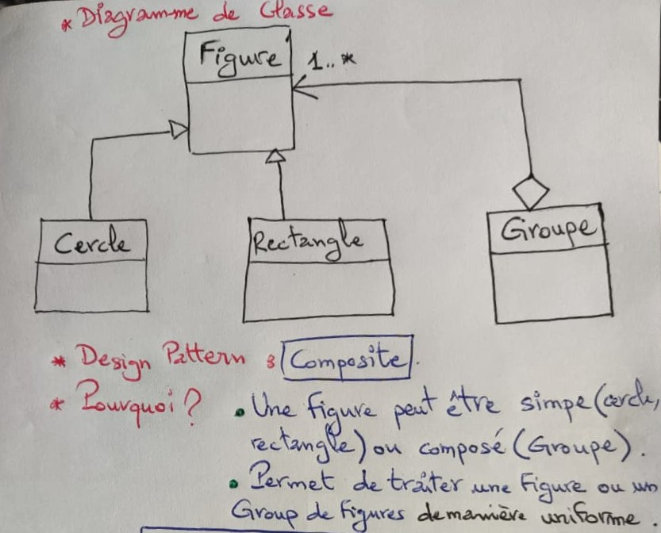
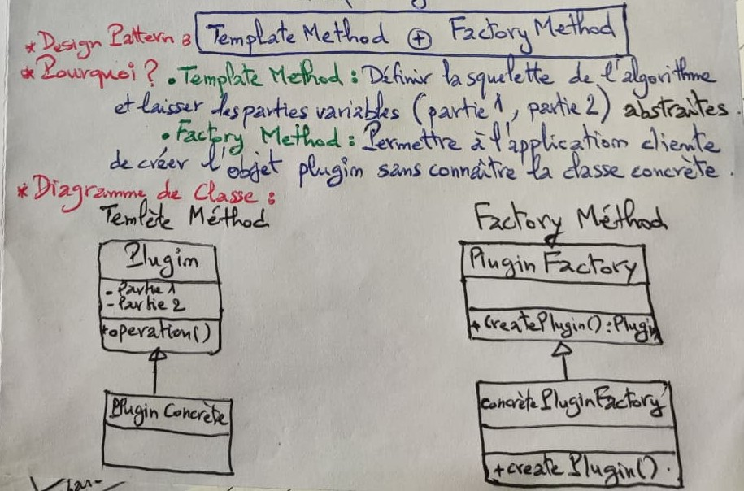
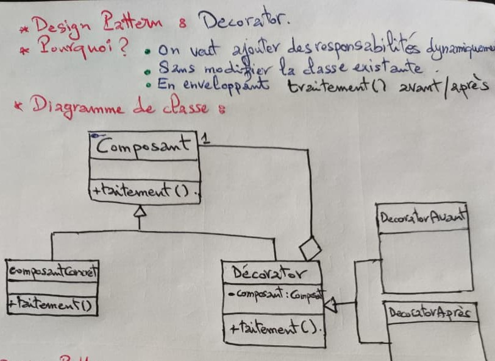
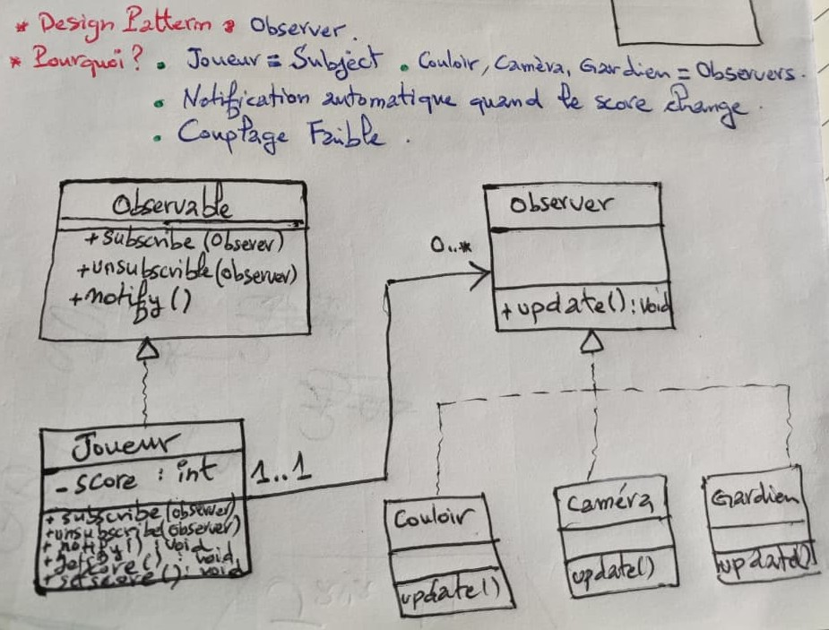
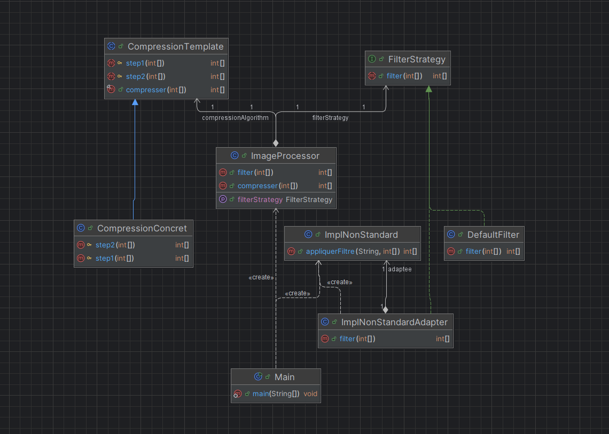
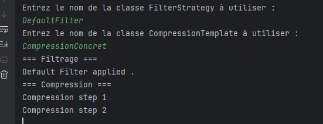
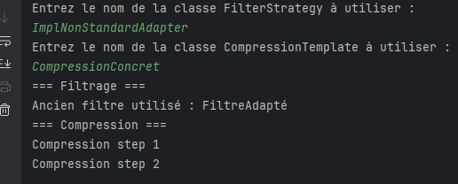

# 🧩 Activité Pratique – Design Patterns (Composite, Template Method, Factory Method, Decorator, Observer, Strategy, Adapter)

Ce dépôt regroupe l’ensemble des travaux réalisés dans le cadre du module **Design Patterns**, encadré par **Mr YOUSSFI Mohamed**.

Il contient :
- ✅ **Exercice 1 : Analyse & Diagrammes UML**
- ✅ **Exercice 2 : Développement d’un Framework Image Processor ** (Strategy + Adapter + Template Method)**

Chaque question est accompagnée d’un **diagramme UML** ou d’une **capture d’exécution**.

---

# ✅ Exercice 1 — Analyse & Diagrammes UML

Dans cet exercice, l’objectif est d’identifier et modéliser le **Design Pattern approprié** pour chaque situation.

---

## 🔸 Q1 — Structure de figures (Cercle, Rectangle, Groupe)

**Objectif :**  
Modéliser une structure hiérarchique où une figure peut contenir d’autres figures.

🎯 **Pattern appliqué : Composite**

📸 Diagramme :  


---

## 🔸 Q2 — Plugin avec squelette d’algorithme et parties variables

**Objectif :**  
Créer un plugin dont deux étapes de l’algorithme sont variables + permettre l’instanciation sans connaître les classes concrètes.

🎯 **Patterns appliqués :**  
- **Template Method** (structure de l’algorithme)  
- **Factory Method** (instanciation flexible)

📸 Diagramme :  


---

## 🔸 Q3 — Ajouter des responsabilités sans modifier le code source

**Objectif :**  
Étendre le comportement d’un composant sans changer son code.

🎯 **Pattern appliqué : Decorator**

📸 Diagramme :  


---

## 🔸 Q4 — Notifier Couloir, Caméra, Gardien lors d’un changement du score

**Objectif :**  
Informer automatiquement d’autres objets lors d’un changement d’état du joueur.

🎯 **Pattern appliqué : Observer**

📸 Diagramme :  


---

# ✅ Exercice 2 — Framework de Traitement d’Images

Ce Framework Java applique des opérations de **filtrage** et **compression** sur une image représentée par un tableau d’entiers.

---

## 🎯 Objectifs du Framework

- Permettre un **changement dynamique du filtre** utilisé  
- Autoriser l’ajout de **nouvelles stratégies de filtrage** (Pattern Strategy)  
- Supporter une **ancienne implémentation non conforme** (Pattern Adapter)  
- Définir le **squelette de compression** via Template Method  
- Charger dynamiquement les classes avec `Class.forName`  
- Rester **ouvert à l’extension et fermé à la modification** (OCP)

---

# 📦 Structure du projet

Le Framework est organisé en **3 packages** principaux :

context/
ImageProcessor

strategy/
FilterStrategy (interface)

impl/
DefaultFilter
ImplNonStandard
ImplNonStandardAdapter
CompressionTemplate
CompressionConcret
---

# 📘 Diagramme du Framework

📸 **Diagramme UML :**  


---

# 🖼️ Filtrage — Stratégie par Défaut

📸 **Exemple d’exécution avec DefaultFilter :**  


---

# 🖼️ Filtrage — Ancienne Version Adaptée

📸 **Exemple d’exécution avec ImplNonStandardAdapter :**  


---

# 🚀 Exécution du projet

```bash
git clone https://github.com/your_repo/design-patterns-framework.git
cd design-patterns-framework
mvn clean install
java -jar target/framework.jar
